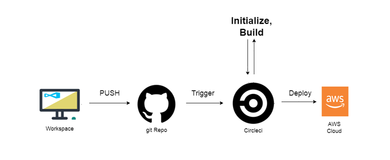

# The overview of the pipeline repo --> Github ---> circleCI --> AWS

the flow of the pipeline diagram 
 

1- We use a workstation to develop and maintain our project commit changes to local git and then push the changes to the remote (github repo) 

2- the github trigger the changes to circleci
 
3- Circleci will follow the configuration in the .circleci/config.yml as follow:  

    - Circleci will prepare the docker environment and install environment dependancy.
    - Circleci will go throw build script
    - Circleci will wait response because of "hold" in the coniguration
    - Circleci will excute the deploy script
    
4- AWS elastic bean stalk will create a new application version and update the env variable

5- AWS S3 bucket will be updated with the www files
